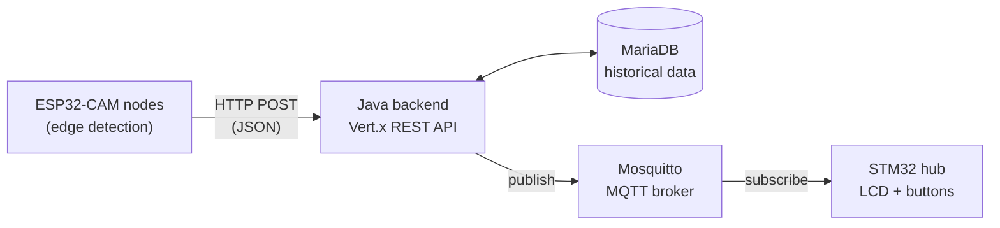

# SSDA – Bus Stop Occupancy Monitoring System

**SSDA** (*Sistema de Seguimiento y Distribución de Autobuses*) is an end-to-end IoT system that monitors bus stop occupancy in real time. Low-cost ESP32-CAM nodes detect occupancy locally at the edge, a Java backend stores and exposes the data through a REST API, and an MQTT channel pushes the live status of each stop to a central display unit.

Developed as a team project for the *Distributed Application Development* course of the Computer Engineering degree at the University of Seville.

---

## Architecture



The system has four parts:

- **Edge nodes (ESP32-CAM):** one camera per bus stop. Each node analyses frames locally and sends only lightweight detection events to the backend over WiFi via HTTP, never raw images.
- **Backend (Java + Vert.x):** an asynchronous REST API that manages cameras, actuators, stop groups and detections, and persists everything in MariaDB.
- **Messaging (MQTT):** an MQTT client inside the backend periodically publishes the status of each stop to a Mosquitto broker, with one topic per stop group.
- **Control hub (STM32):** a board with built-in WiFi subscribes to the stop topics and shows the status on an LCD. Physical buttons let the operator switch between stops.

## Edge detection algorithm

Running a neural network was not viable on the ESP32-CAM, so occupancy is detected with a lightweight **frame-differencing** algorithm:

- Frames are captured at **QVGA (320×240)**.
- Each frame is split into **16×16-pixel blocks**, and each block is compared with the same block in the previous frame.
- A block whose change exceeds a **20% threshold** counts as movement and triggers a detection event.
- The previous and current frame buffers are allocated once and reused, which avoids heap fragmentation on the microcontroller.

## REST API

The backend listens on port `8080`. All endpoints use JSON.

| Resource | Endpoints |
|---|---|
| Cameras | `GET /api/camara` · `GET /api/camara/:id` · `POST /api/camara` · `PUT /api/camara/:id` · `DELETE /api/camara/:id` |
| Actuators | `GET /api/actuators/:id` · `POST /api/actuators` · `PUT /api/actuators/:id` · `DELETE /api/actuators/:id` |
| Stop groups | `GET /api/groups` · `GET /api/groups/:id` · `POST /api/groups` · `PUT /api/groups/:id` · `DELETE /api/groups/:id` |
| Detections | `GET /api/detecciones` · `GET /api/detecciones/:idCamara` · `POST /api/detecciones` |
| Actuator state | `GET /api/estados-actuador/:idActuador` · `POST /api/estados-actuador` |
| Alerts | `GET /api/alertas/parada-llena/:idCamara` (is the stop full?) |

The API was tested with **Postman** during development.

## Tech stack

| Layer | Technologies |
|---|---|
| Edge firmware | C++ (Arduino framework), ESP32-CAM, `HTTPClient` |
| Backend | Java 11, Vert.x 4.5 (Web, Web Client, MySQL Client, MQTT), Maven |
| Database | MariaDB / MySQL |
| Messaging | MQTT, Eclipse Mosquitto |
| Control hub | C (STM32 HAL, STM32CubeIDE), STM32L475 with WiFi module, Paho MQTT Embedded C, HD44780 LCD |
| Testing | Postman |

## Repository structure

```
SSDA/
├── Camara/           # ESP32-CAM firmware: capture, edge detection, HTTP client
├── ConexionCamara/   # Java backend: Vert.x REST API, MQTT publisher, DB service
├── BaseDeDatos/      # SQL schema and example queries
└── WiFi_MQTT/        # STM32 firmware: WiFi, MQTT subscriber, LCD and buttons
```

## Getting started

**Requirements:** Java 11+, Maven, MariaDB or MySQL, a Mosquitto broker, Arduino IDE (with ESP32 support) and STM32CubeIDE.

1. **Database:** create the database and run `BaseDeDatos/Tablas.sql` to create the tables.
2. **Backend:** set the database credentials in `DatabaseService.java` and the broker address in `MqttClientVerticle.java`, then build and run:
   ```bash
   cd ConexionCamara
   mvn package
   java -jar target/ConexionCamara-0.0.1-SNAPSHOT.jar
   ```
3. **MQTT broker:** start Mosquitto on port `1883`.
4. **ESP32-CAM:** set the WiFi credentials and the backend IP in `Camara/codigo_conteo/codigo_conteo.ino`, then flash it from the Arduino IDE.
5. **STM32 hub:** set the WiFi credentials and the broker address in `WiFi_MQTT/Core/Src/main.c`, then build and flash it from STM32CubeIDE.

Once everything is running, detections appear in the database and the hub's LCD shows the live status of the selected stop.

## Authors

- Sirio Randazzo Lecubarri
- Sergio Garrido Caballero
- Antonio Presencio de Olmedo
- Daniel Salamanca Garrido

Computer Engineering students, University of Seville.
